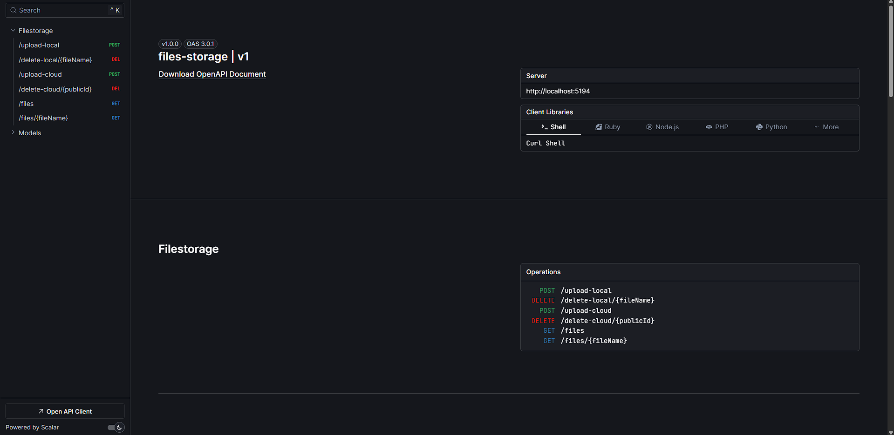

# 📁 Upload Storage Files

O Upload Storage Files é um projeto pessoal para gerenciar arquivos de forma prática e segura, com suporte a upload, armazenamento local ou na nuvem (Cloudinary) e exclusão de arquivos.
Ele valida o tamanho e tipo dos arquivos para evitar erros e problemas.
Para garantir performance e escalabilidade, usa mensageria com RabbitMQ para processar uploads e exclusões de forma assíncrona, deixando o sistema mais rápido e estável.
A arquitetura segue o padrão MVC adaptado para APIs REST, deixando o código organizado e fácil de manter.

## 🚀 Funcionalidades

- Upload de arquivos (com validação de tipo e tamanho)
- ☁️ Armazenamento local ou em nuvem (Cloudinary)
- ❌ Exclusão de arquivos enviados
- 🔒 Validação e segurança via variáveis de ambiente
- 🐳 Pronto para execução com Docker
- 🐰 Processamento assíncrono de uploads e deleções via mensageria RabbitMQ

---

## 🏗️ Arquitetura do Projeto

O projeto segue o padrão MVC adaptado para APIs REST, com a seguinte estrutura principal:

- **Model:** Classes que representam entidades e regras de negócio (na pasta `Models`).
- **DTOs:** Objetos de transferência de dados para comunicação clara e segura entre camadas (`Dtos`).
- **Controller:** Responsáveis por receber requisições HTTP e orquestrar as chamadas aos serviços (`Controllers`).
- **Services:** Contém a lógica de negócio e integração com repositórios e mensageria (`Services`).
- **Repository:** Abstração do acesso a dados e operações com o banco (`Repository`).
- **Messaging:** Implementação da mensageria com RabbitMQ para processamento assíncrono de uploads e deleções (`Messaging`).
- **Context:** Configuração do banco de dados e contexto do Entity Framework Core (`Context`).
- **Seed:** Inicialização e população do banco para testes e desenvolvimento (`Seed`).
- **Shared:** Código compartilhado e utilitários diversos (`Shared`).

## 📄 Documentação da API

Este projeto utiliza Scalar para documentação automática da API REST, facilitando a visualização, teste e manutenção dos endpoints.
A documentação fica disponível para facilitar o entendimento e consumo da API por outros desenvolvedores e serviços.

**Como acessar**
Após rodar o projeto localmente, acesse a documentação pelo navegador em:

        $ http://localhost:5194/scalar

**Prévia da documentação**



## 🧪 Testes

O projeto conta com uma boa cobertura de testes para garantir a qualidade:

- **Testes Unitários:** Validação isolada de componentes usando **Moq** para simulação de dependências.
- **Testes de Integração:** Executados em banco de dados **in-memory** para simular operações reais sem impacto no ambiente.

---

## 🛠️ Tecnologias Utilizadas

- [.NET](https://dotnet.microsoft.com/pt-br/)
- [ASP.NET Core](https://learn.microsoft.com/pt-br/aspnet/core/?view=aspnetcore-9.0&WT.mc_id=dotnet-35129-website)
- [CloudinaryDotNet](https://cloudinary.com/documentation/dotnet_integration)
- [RabbitMQ](https://www.rabbitmq.com/)
- [Moq](https://github.com/moq/moq4)
- [InMemory](https://learn.microsoft.com/pt-br/ef/core/providers/in-memory/?tabs=dotnet-core-cli)
- [Docker](https://www.docker.com/)

---

⚙️ **Como Rodar o Projeto**

Para rodar o projeto em seu ambiente local, siga os passos abaixo:

Primeiramente, clone o repositório do GitHub para sua máquina local:

    $ git clone https://github.com/Faelkk/micro-service-auth.git

Acesse o diretório do projeto e instale as dependências:

        $ dotnet restore

Configurar as variaveis de ambientes

```json
"Cloudinary": {
"CloudName": "SEU_CLOUD_NAME",
"ApiKey": "SUA_API_KEY",
"ApiSecret": "SEU_API_SECRET"
}
```

Finalmente, inicie o projeto rodando

        $ dotnet run

<br>

**🤝 Como Contribuir?**

- ⭐ Dando uma estrela no repositório

- 🧑‍💻 Me seguindo aqui no GitHub

- 🤝 Conectando-se comigo no LinkedIn

<br>

**👨‍💻 Autor**

Desenvolvido com 💙 por<br>
[Rafael Achtenberg](linkedin.com/in/rafael-achtenberg-7a4b12284/)
